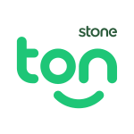

# Venha para o Ton
:handshake: Venha fazer parte do nosso time! #SeLigaNoTon

## Sobre o Ton
O Ton é uma empresa de tecnologia que ajuda milhares de empreendendores a vender mais e crescer seus negócios.

Fazemos parte do grupo Stone Co. e juntos estamos transformando o mercado no Brasil, permitindo que cada vez mais pessoas consigam transformar oportunidades em negócios de sucesso.

### Qual seria o perfil da pessoa perfeita para o Ton?
Estamos procurando uma pessoa que saiba fazer uma aplicação, mas acima de tudo queremos avaliar a qualidade da sua entrega, o conhecimento das ferramentas que você utiliza e suas motivações para escolha de uma determinada solução.

### Super dicas
- Capriche no código!
- Revise seu código antes de enviar
- Se você é junior, não faça um desafio full-stack, foque no que você faz melhor!

**DO:**
- Keep It Simple (KISS)
- Clean code (https://github.com/ryanmcdermott/clean-code-javascript)
- Versionamento (aqui usamos essa convenção: https://www.conventionalcommits.org/en/v1.0.0/#summary)
- Tenha conhecimento da ferramenta/framework, consiga explicar como escalar ela
- Queremos que você pense em uma solução com a menor complexidade possível para o problema proposto

**DON'T:**
- Código Spaghetti
- Código/solução complexa
- Falta de atenção ao código/desafio
- Pensar que a solução que usa no dia-a-dia resolve todos os problemas para todos os desafios
